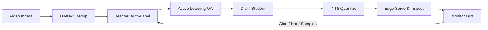

# SIVIA — Self-Improving Visual Inspection Agent

[](https://github.com/agrimsri/sivia/actions/workflows/ci.yml)
[](LICENSE)
[](https://www.python.org/downloads/)

> **Type the name of a new object, and within minutes a small, fast, custom detector is running on-device. When it fails in the real world, it detects the failure, mines hard samples, and improves itself.**

---

## 1. Overview

**SIVIA (Self-Improving Visual Inspection Agent)** is an end-to-end computer vision and MLOps system built for real-time workbench kit verification and edge visual inspection.

Instead of deploying slow, GPU-bound foundation models directly on the edge, SIVIA uses an automated **Teacher-Student distillation loop**:
1. **Teacher:** High-capacity zero-shot foundation models (**OWLv2 / Grounding DINO + SAM 2**) automatically label raw, deduplicated video streams from text prompts alone.
2. **Quality Assurance:** Multi-signal active learning scores label risk, routing only uncertain samples for review.
3. **Student:** A compact, fast detector (**YOLO11 / RT-DETR**) is trained via soft pseudo-label distillation and exported to static INT8 QDQ ONNX for real-time edge execution.
4. **Self-Improvement:** Multimodal drift monitoring (embedding MMD, prediction shifts, input blur) flags hard failures, triggers targeted retrain cycles, and safely updates the running model through a zero-downtime hot-swap guarded by a champion/challenger gate.

---

## 2. The Continuous Improvement Loop



---

## 3. Benchmark Headline Results

The table below summarizes performance across the distillation and quantization pipeline:

| Model Variant | Backbone / Format | Parameters | Model Size | Latency p50 (CPU) | FPS | mAP@0.5 | mAP@0.5:0.95 |
|---|---|---|---|---|---|---|---|
| **Teacher Ensemble** | OWLv2 + GDINO + SAM 2 | ~1.5 B | 3.2 GB | ~650 ms | 1.5 | **1.000** | **0.861** |
| **Student Baseline (FP32)** | YOLO11n / PyTorch | 2.6 M | 5.4 MB | ~28 ms | ~35 | *Pending M4* | *Pending M4* |
| **Distilled Student (FP32)** | YOLO11n / ONNX | 2.6 M | 5.2 MB | ~24 ms | ~41 | *Pending M5* | *Pending M5* |
| **Distilled Student (INT8)** | YOLO11n / ONNX QDQ | 2.6 M | 1.5 MB | **~14 ms** | **~71** | *Pending M7* | *Pending M7* |

> **Labeling Time Saved:** Zero-shot teacher auto-labeling achieved **99.9% wall-clock reduction** (4.99 hours saved across dataset pool) compared to the measured 64.8s/image manual human baseline.

---

## 4. Quickstart

### Prerequisites
- Python 3.11 or 3.12
- Linux / macOS (NVIDIA GPU optional, full CPU fallback supported)
- [uv](https://github.com/astral-sh/uv) (recommended) or standard venv

### Setup Environment
```bash
# Clone repository
git clone https://github.com/agrimsri/sivia.git
cd sivia

# Automatic setup (creates venv, installs dependencies and pre-commit)
make setup

# Activate environment
source .venv/bin/activate
```

### Run Hardware Probe & Tests
```bash
# Probe system hardware and generate optimal compute profile
python scripts/probe_hardware.py

# Run code quality checks
make lint

# Run unit tests
make test
```

---

## 5. Repository Structure

```
sivia/
├── configs/                # Compute profiles, kit schemas, training & serving configs
│   ├── compute/            # auto.yaml, gpu.yaml, cpu.yaml, colab.yaml
│   └── kits/               # desk_kit_v1.yaml (classes, prompts, slots, rules)
├── src/sivia/              # Core library
│   ├── capture/            # Video ingest, frame sampling, Laplacian blur filter
│   ├── store/              # SQLite schema, migrations, CRUD repository
│   ├── embeddings/         # DINOv2 embeddings, FAISS indexing, semantic dedup
│   ├── labeling/           # Zero-shot teacher wrappers (OWLv2, GDINO, SAM 2, ensemble)
│   ├── qa/                 # Active learning, uncertainty scoring, Label Studio IO
│   ├── training/           # Student trainer, Albumentations, soft distillation
│   ├── evaluation/         # COCO evaluation, TIDE reports, corruption robustness
│   ├── optimize/           # ONNX export, INT8 QDQ static quantization, benchmarking
│   ├── serving/            # FastAPI runtime, zero-downtime hot-swap, Prometheus metrics
│   ├── kit/                # Kit specification schemas and verification logic
│   ├── reasoning/          # VLM failure explanations and hybrid video search
│   ├── monitoring/         # MMD embedding drift, input statistics, hard sample mining
│   ├── loop/               # Closed-loop orchestrator, champion/challenger gate
│   └── ui/                 # Multi-tab Gradio interface
├── scripts/                # Hardware probe, toy fixture generator, pipeline helpers
├── tests/                  # Unit tests, integration tests, toy smoke fixtures
└── docs/                   # Architecture, milestone reports, interview cheat sheet
```

---

## 6. License

This project is licensed under the [Apache License 2.0](LICENSE).
