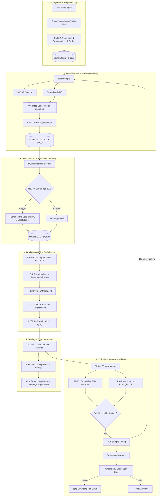

# SIVIA Architecture — Self-Improving Visual Inspection Agent

> **One-line pitch:** *Type the name of a new object, and within minutes a small, fast, custom detector is running on-device. When it fails in the real world, it detects the failure, mines hard samples, and improves itself.*

---

## 1. System Overview

SIVIA is an edge-first, self-improving visual inspection system engineered for high-reliability workstation kit verification (e.g., verifying tools, modules, and components are complete and correctly placed).

Rather than deploying slow, GPU-intensive foundation models directly to edge cameras, SIVIA leverages a **Teacher-Student distillation paradigm**:
- **Teacher (Zero-Shot Foundation Ensemble):** Open-vocabulary detectors (OWLv2 / Grounding DINO) combined with instance segmentation (SAM 2). High accuracy, open vocabulary, but high latency and resource cost.
- **Student (Edge Detector):** Compact closed-set detector (YOLO11 / RT-DETR) quantized to INT8 running via ONNX Runtime / OpenVINO on edge CPU/iGPU.
- **The Self-Improving Loop:** Continuous operational monitoring flags distribution shift and hard failure cases, routes them through active learning and teacher auto-labeling, retrains a candidate student, and performs zero-downtime hot-swapping behind a strict champion/challenger gate.

---

## 2. End-to-End Loop Flowchart

---

## 3. Teacher vs. Student Framing

| Characteristic | Teacher Ensemble (OWLv2 + GDINO + SAM 2) | Student Detector (YOLO11 / RT-DETR INT8) |
|---|---|---|
| **Vocabulary** | Open-vocabulary (natural language text prompts) | Closed-set (fixed target kit classes) |
| **Model Size** | > 1.5 GB | < 15 MB |
| **Target Hardware** | NVIDIA GPU (>= 8 GB VRAM) | Commodity CPU / Edge iGPU |
| **Inference Latency** | 250 – 800 ms / frame | 15 – 35 ms / frame (Real-time >= 30 FPS) |
| **Execution Mode** | Batch auto-labeler (offline or cloud) | Streaming edge inference (on-device) |
| **Determinism** | Sensitive to prompt phrasing | Deterministic feedforward tensor execution |

---

## 4. Module Decomposition

- `sivia.capture`: Video stream ingestion, keyframe sampling, Laplacian blur filtering, brightness assessment.
- `sivia.embeddings`: DINOv2 ViT-S/14 image embeddings, FAISS L2/cosine index, semantic deduplication.
- `sivia.labeling`: OWLv2, Grounding DINO, SAM 2 wrappers, Weighted Boxes Fusion, COCO/YOLO exporters.
- `sivia.qa`: Uncertainty estimation, teacher disagreement scoring, review queue generation, Label Studio IO.
- `sivia.training`: Student trainer abstraction, Albumentations pipeline, soft-label distillation loss, MLflow logging.
- `sivia.evaluation`: COCO mAP metrics, TIDE error taxonomy, deterministic corruption benchmark suite.
- `sivia.optimize`: ONNX graph export, static INT8 QDQ quantization, latency/memory benchmark harness.
- `sivia.serving`: FastAPI REST/WebSocket endpoints, zero-downtime model hot-swap engine, Prometheus telemetry.
- `sivia.kit`: Structured kit specification schemas, slot ROI validation, completeness verdict logic.
- `sivia.reasoning`: Vision-Language Model (Qwen2-VL / SmolVLM) failure explanations, natural language video search.
- `sivia.monitoring`: Embedding MMD drift, input distribution statistics, hard sample mining.
- `sivia.loop`: Closed-loop retrain orchestrator, champion/challenger gate, automated rollback.
- `sivia.ui`: Gradio multi-tab dashboard (Live inspection, add object, review, monitoring, search).

---

## 5. Data Contracts & Split Policy

1. **Session-Level Splitting:** Dataset splits (Train: 70%, Val: 15%, Test: 15%) are partitioned strictly by recording session / video source, completely eliminating near-duplicate frame leakage.
2. **Frozen Test Set:** The test split is frozen during M2 and never updated or exposed to pseudo-labeling.
3. **Gold Set:** An independently verified human-labeled dataset of >= 200 images used as the ground-truth benchmark for teacher and student evaluations.
4. **Relational Metadata:** Managed via SQLite (`sivia.db`), tracking all samples, bounding boxes, segmentation masks, experiment runs, model versions, and system events.
